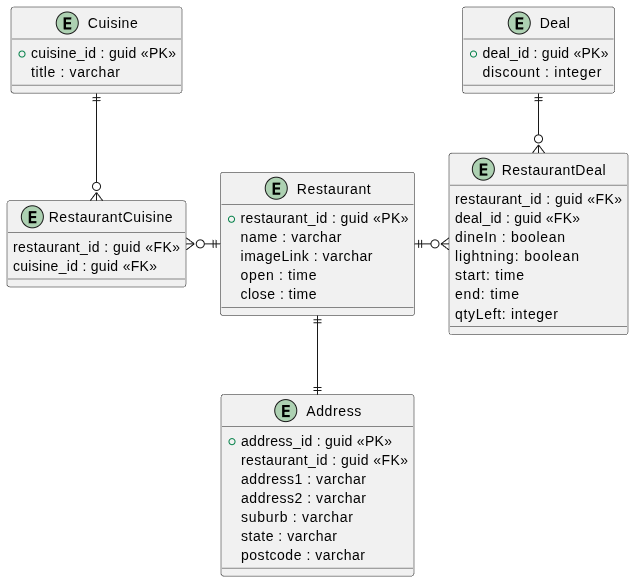

# Solution comments

## Java 21
Since no Java was specified in the requirements I've used Java 21 cause it's what I have installed on my laptop. The code shouldn't have any version specific syntax or paradigms, not since Java 9 stream API with the exception of `record` for simple data objects to avoid extra boilerplate or  libraries like `lombok` or `immutables`.

It runs as a SpringBoot Web rest api and could be accessed by calling 

```
curl http://localhost:8080/deals/active?timeOfDay=3:00pm
curl http://localhost:8080/deals/peak-hours
```

The starter project generate from [Spring Initializr](https://start.spring.io/)

## Assumptions and limitations
I had to make several assumptions about the requirements and implementation as described below:

### Static JSON
I'm using **static JSON file** instead of making an actual HTTP call, I've placed the `challengedata.json` in the `resources` of the project.

### Field inconsistency
In `challengedata.json` the `deal` objects sometimes have fields named as `start/end` and sometimes as `close/open`. I've made an assumption it was a copy-paste mistake and **have fixed all deals to have `start/end`** to simplify implementation rather than write a fallaback code.

### Field ommition and fallback
Some of the deals have neither `start/end` nor `open/close`, in that case I consider the **deal to be active during the restaurant's openning times**. Basically the deal's `start` and `end` fields would fall back to restaurant's `open` and `close` fields. I **don't** handle an edge case where either one or both `start/open` fields are missing on `restaurant` object. 

### Deals overlapping midnight 
While not presented in the test data, I've tried to cover the case when a restaurant and a deal cross midnight. i.e something that would have 

```
"start":"9:00pm",
"end":"2:00am"
```

That _does_ sounds like a valid case for hospitality business, so I've tried to cover for that. 


### (Not)considering quantity

I've noticed there is a numerical field `qtyLeft` in `deal` object, but there was no mention of it in the requirements, so I haven't filtered out the values based on that. Though I've added a `//TODO` and commented out the code which should do that. Also the variable name could be open to ambiguity and might mean `qualityLeftovers` for all I know. 


## Solution implementation

### Active deals by time

The code simply iterates over each restaurant and each deal and checks whenever the provided time fits in the boundaries of the deal. I calculate `start` time to be inclusive and `end` exclusive. The only caveats are as mentioned: fallbacks to restaurant `open/close` hours and crossing the midnight. Given that in theory that call would proxy to backend gateway there is no point of building any more complicated data structure that would have better search time since the underlying data would constantly change. 

### Peak hours

Maximum overlapping intervals task, so breaking intervals into events that either increase or decrease the counter and finding the max. Again working around the midnight, turning the 2100-0200 into two intervals, 2100-2359 and 0000-0200. The limitation of that task is that if there are multiple peak hours window only the first one would be returned. But this is a solution of a real business problem rather than theoretical Computer Science question, so the solution should suffice.

### DB Schema 

#### Choosing DB
To actually store that data in marketplace system it makes sense to use a relation databse since the are clear relations between the objects. 

The most common ones and the ones I'm familiar with are MySQL and PostgreSQL. Knowing as much as I know about the task I would suggest MySQL, because:

* there would be much more reads than writes and MySQL is a bit more read-optimized
* this data looks like a "select all" query and is fine for MySQL
* it's a restaurant search platform not financial ledger so things like ACID are not that important

While a good thing about PostgreSQL is that it could be easily used for Geospatial search if we decide to have lat/long on the `Address` table and query based on that, to show on a map for example. 

#### Comments

* I've added few more fields to `Address` table, without `state` or `postcode` fields the address might be too ambiguos. I assume that all restaurants are in Australia, so no `country` field
* Looking at sample data I could see that the deal with the same ID could belong to different restaurants, but I had to make a guess that it's only the `discount` field that would be the same, i.e. part of the deal itself and notg deal/restaurant relation.
* For simplicity I assume that `discount` field is the "discount %"

#### Diagram. 

Diagram is stored in [db-schema.puml](db-schema.puml), created using [PlantUML syntax](https://plantuml.com/)




## AI usage

I've used VS Code, but for this task I've mostly used AI to generate models from the JSON response and some co-pilot auto-complete code, rather than agentic vibe-coding. 

